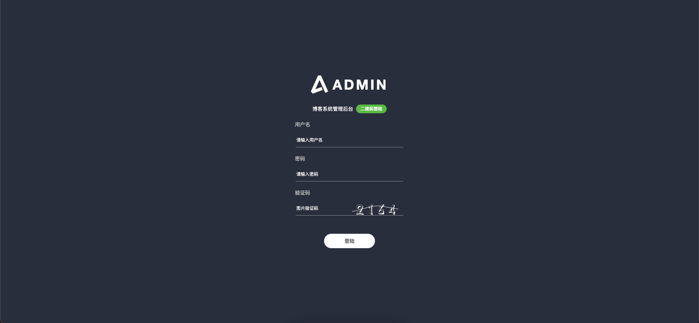
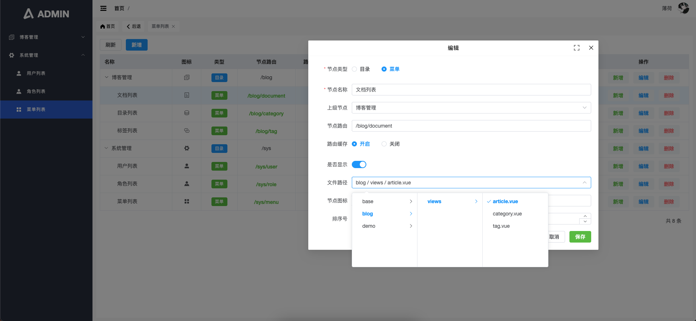
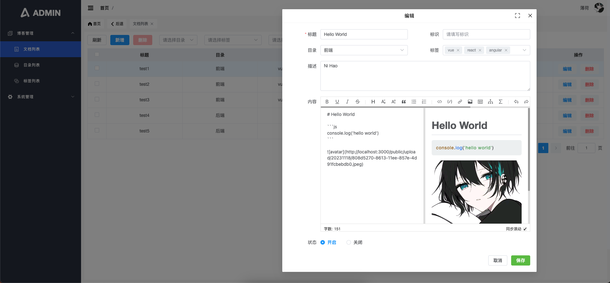

# Vue3 博客管理系统客户端

## 技术选型

- [Vue3](https://cn.vuejs.org/) - 基础框架
- [VueRouter](https://router.vuejs.org/) - Vue.js 官方路由
- [Pinia](https://pinia.vuejs.org/) - 轻量级状态管理库
- [ElementPlus](https://element-plus.org/zh-CN/) - 桌面端组件库
- [Vite](https://cn.vitejs.dev/) - 构建工具

## 开始

需要运行配套 Node 后端服务：[admin-server](https://github.com/bohecola/admin-server)

后端服务仓库地址：https://github.com/bohecola/admin-server

```sh
git clone https://github.com/bohecola/admin-server.git
```

### 安装依赖

```sh
yarn install
```

### 运行应用

```sh
yarn dev
```

在浏览器中预览网站 [http://localhost:8080](http://localhost:8080)

```sh
账号：bohecola
密码：123456
```

登陆页



菜单页



博客编辑



## 参考

[Cool-Admin 后台管理系统](https://cool-js.com)

[@cool-vue/crud](https://www.npmjs.com/package/@cool-vue/crud) 快速 CRUD